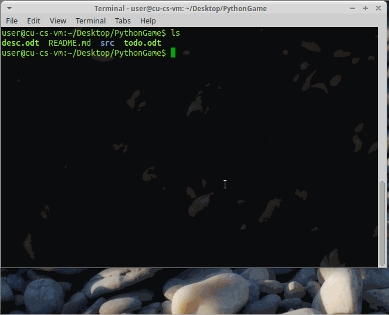

# PythonGame

<br />
<hr />

## Run the game!

In order to run the game, use the terminal to run 

```shell
cd src
python2 pygame_project.py
```

<hr />

#### What could/needs to be done:

+ Score system. - CHECK
+ High Score table. - CHECK
+ "Lives" indicator. - CHECK
+ Enemy bullets that are shot at the player. - CHECK
+ Spread shots (Includes 360 spreads.)
+ A boss fight at the end of the stage. - CHECK (Just finish AI)
+ Have enemy type #3 take multiple hits to destroy. - CHECK
+ Smaller player hitbox. - CHECK
+ Pre-Boss Warning Sign
+ Add in sound effects
+ Multiple stages, each with their own boss or bosses. (3-5 max)
+ New weapons obtained after beating bosses. (Use the "C" key to cycle through them.)
+ Boss health bars.
+ More enemy types and behaviors.
+ Multiple loops (A "loop" means that upon beating the last boss, the game is reset to stage 1, but at a much higher difficulty level.)
+ True final boss that can only be fought at the end of loop 2 and above.
+ A good name for the game.

<hr />

#### Created By Spencer Hanson and Zachary Haney

This game is a game of the Danmaku genre. Danmaku, more commonly known as "Bullet Hell" is a type of scrolling shoot-em-up where enemies send down curtains of bullets that the player must navigate through by using a ship with a small hit box, while simultaneously shooting back at the enemies in order to score points. Stages in danmaku games consist of several waves of enemies shooting various patterns of bullets. A typical stage is punctuated by an encounter with a boss, which is significantly tougher than the stage enemies, and often fires more complicated, harder-to -dodge patterns. Sometimes a stage may have a "sub-boss" which appears near the middle of the stage, serving as an obstacle until the player can defeat it.

Our game consists of a single stage, populated by three very basic types of enemies. These enemies are the "Ram," which mindlessly flies forward, does not shoot, and relies solely on colliding with the player; the "Drone," which briefly appears on screen, fires a bullet, and then leaves; and the "Brute" which fires large volleys of bullets. Originally we had intended to have this third enemy class take multiple hits to destroy, but we could not implement this, despite having the time to do so, due to a major disagreement between us. A boss at the end of the stage was planned as well, but time constraints forced us to scrap it, but the code for it is still present.

The player controls a single ship. The ship's movement is governed by the arrow keys, and the player presses 'Z' to fire the ship's laser cannon. A single hit from anything will destroy the ship, causing the player to lose a life. Once all three lives are depleted, it's Game Over. We had originally planned for the ship to have a small hitbox, as in a true danmaku game, to assist the player with navigating the bullet patterns. However, went were unable to implement it due to time constraints and more disagreements.

